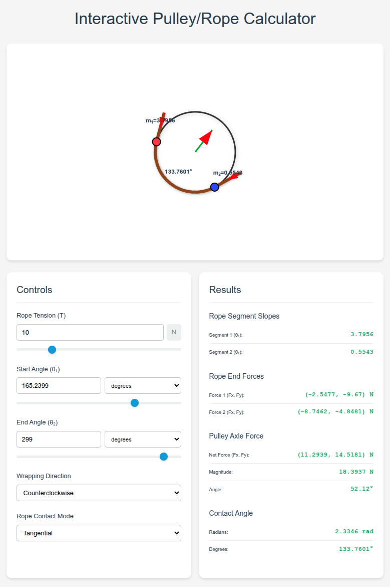

# Interactive Pulley/Rope Contact Calculator

A web-based physics simulation tool for analyzing forces and contact angles in pulley-rope systems. This interactive calculator provides real-time visualization and calculations for both perpendicular and tangential rope contact modes.

## 🚀 [**Try the Live Demo**](https://sbosshardt.github.io/pulley-rope-contact-calculator/)

[](https://sbosshardt.github.io/pulley-rope-contact-calculator/)

## Features

### 🎯 **Interactive Visualization**
- **Drag-and-drop contact points** - Move rope contact points around the pulley by dragging
- **Real-time updates** - All calculations and visualizations update instantly
- **SVG-based rendering** - Smooth, scalable graphics that work on all devices
- **Force vector visualization** - See rope tension and axle forces as arrows

### 🔧 **Physics Calculations**
- **Rope segment slopes** - Calculate slopes of straight rope segments
- **Force analysis** - Compute rope tension forces and net axle forces
- **Contact angles** - Calculate the angle of rope wrap around the pulley
- **Multiple unit systems** - Support for degrees, radians, and π radians

### 📱 **Responsive Design**
- **Mobile-friendly** - Touch-optimized controls and layout
- **Adaptive layout** - Controls move below visualization on narrow screens
- **Modern UI** - Clean, professional interface with intuitive controls

## Getting Started

### 🌐 Try Online
The easiest way to use the calculator is through the **[live demo](https://sbosshardt.github.io/pulley-rope-contact-calculator/)** - no installation required!

### 💻 Run Locally
1. Clone or download this repository
2. Open `index.html` in any modern web browser
3. Start experimenting with the controls!

No build process, dependencies, or server required - it's pure HTML, CSS, and JavaScript.

### Local Development
For local development with live reloading:
```bash
# Navigate to project directory
cd contact-angle-forces

# Start a simple HTTP server (Python 3)
python3 -m http.server 8000

# Or using Node.js
npx http-server

# Open http://localhost:8000 in your browser
```

## Usage Guide

### Basic Controls
- **Rope Tension (T)**: Set the tension force in the rope (Newtons)
- **Start Angle (θ₁)**: Position of first contact point (0° = right, 90° = top)
- **End Angle (θ₂)**: Position of second contact point
- **Wrapping Direction**: Clockwise or counterclockwise rope wrap
- **Contact Mode**: Choose between perpendicular (radial) or tangential rope contact

### Contact Modes

#### Tangential Mode (Default)
Realistic rope behavior where the rope extends tangent to the pulley surface:
- More physically accurate for real rope-pulley systems
- Rope segments extend tangentially from contact points
- Forces represent actual rope tension and pulley loads

#### Perpendicular Mode
Simplified model where rope extends radially from the pulley center:
- Useful for theoretical analysis and education
- Simpler force calculations
- Good for understanding basic pulley mechanics

### Interactive Features
- **Drag contact points**: Click and drag the red and blue contact points around the pulley
- **Real-time sliders**: Use sliders for quick adjustments
- **Unit conversion**: Each angle input has its own unit selector
- **Force visualization**: Colored arrows show force directions and magnitudes

## Physics Background

### Force Analysis
The calculator computes several types of forces:

1. **Rope End Forces**: The tension forces that someone holding the rope would feel
2. **Axle Force**: The net force the rope system applies to the pulley
3. **Force Components**: X and Y components of all forces in Cartesian coordinates

### Contact Angles
The contact angle is the angular span of rope wrapped around the pulley:
- **Counterclockwise wrap**: θ₂ - θ₁ (normalized to [0, 2π))
- **Clockwise wrap**: θ₁ - θ₂ (normalized to [0, 2π))

### Coordinate System
- **0°** = Rightmost point (3 o'clock position)
- **90°** = Topmost point (12 o'clock position)
- **180°** = Leftmost point (9 o'clock position)
- **270°** = Bottommost point (6 o'clock position)
- **Positive angles** = Counterclockwise rotation (standard mathematical convention)

## Example Configurations

### L-Shape Configuration (Default)
- Start Angle: 180° (left side)
- End Angle: 270° (bottom)
- Contact Mode: Tangential
- Result: Creates an L-shaped rope path

### Straight Pull
- Start Angle: 0° (right side)
- End Angle: 180° (left side)
- Contact Mode: Tangential
- Result: Rope pulls straight across the pulley

### Quarter Wrap
- Start Angle: 0° (right side)
- End Angle: 90° (top)
- Contact Mode: Tangential
- Result: 90° rope wrap around pulley

## Technical Details

### Architecture
- **HTML**: Semantic structure with responsive layout containers
- **CSS**: Modern flexbox/grid layout with touch-friendly controls
- **JavaScript**: Modular ES6 class-based architecture

### Key Components
- `PulleyCalculator` class: Main application logic
- Physics calculations: Force analysis and geometry
- SVG rendering: Interactive visualization
- Event handling: Mouse and touch interactions

### Browser Compatibility
- **Modern browsers**: Chrome, Firefox, Safari, Edge (latest versions)
- **Mobile**: iOS Safari, Android Chrome
- **Requirements**: ES6 support, SVG support

## Development

### File Structure
```
contact-angle-forces/
├── index.html          # Main HTML file
├── styles.css          # CSS styling
├── app.js             # JavaScript application logic
├── README.md          # This file
├── LICENSE            # MIT license
└── pulley_rope_calculator_prompt.txt  # Original specification
```

### Code Organization
- **State management**: Centralized application state
- **Event handling**: Unified input synchronization
- **Rendering**: Separate visualization and UI update methods
- **Physics**: Modular calculation functions

### Contributing
1. Fork the repository
2. Create a feature branch
3. Make your changes
4. Test thoroughly
5. Submit a pull request

## Educational Use

This tool is excellent for:
- **Physics education**: Demonstrate pulley mechanics and force analysis
- **Engineering courses**: Analyze mechanical systems and contact forces
- **Interactive learning**: Visual exploration of physics concepts
- **Problem solving**: Verify calculations and explore "what-if" scenarios

## License

This project is licensed under the MIT License - see the [LICENSE](LICENSE) file for details.

## Acknowledgments

- Built with vanilla HTML, CSS, and JavaScript for maximum compatibility
- Inspired by classical mechanics and engineering education needs
- Designed for both educational and practical applications

---

**Questions or suggestions?** Feel free to open an issue or contribute to the project!
